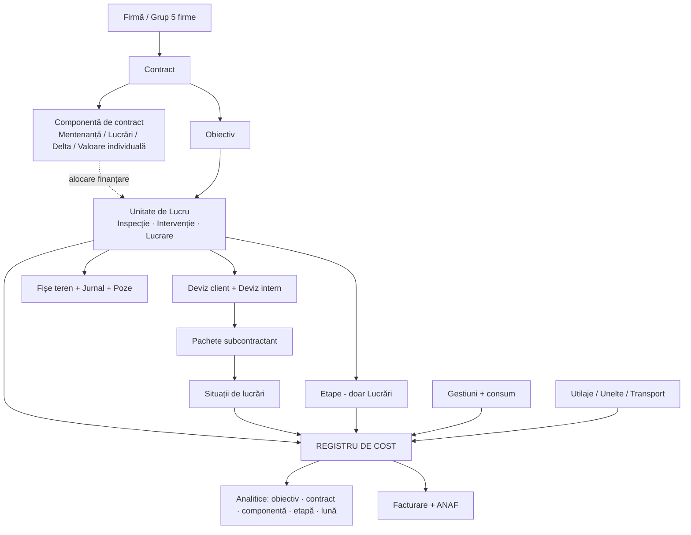

# Damina — structură cap-coadă a aplicației

Document de arhitectură funcțională. Acoperă toate cazurile descrise: 5 firme, contracte individuale, contracte de mentenanță pe 4 ani cu componentele Mentenanță / Lucrări / Delta, lucrări cu facturare inversă, inspecții, intervenții, tichete, devize, situații de lucrări, achiziții, gestiuni, utilaje, unelte, transporturi, documente și ANAF.

Structura documentului:
- **Partea I** — principiile și modelul de date (secțiunile 1–13)
- **Partea II** — fluxurile operaționale (secțiunile 14–20)
- **Partea III** — ce lipsește, ce nu va merge, fazare (secțiunile 21–24)

> **Versiunea 2 — actualizat cu deciziile tale.** Cele 10 întrebări deschise sunt acum închise; răspunsurile sunt centralizate în **§24** și propagate în secțiunile afectate. Modificat față de v1: §4.1 (indexare 5% configurabilă, proprietar de contract), §4.2 (Delta pe lună fără report, Lucrări anual/lunar), §7 (intrare pe email), §8.1 (devizul intern nu ajunge la client), **§13.1 nou** (costurile urmează unitatea de lucru), §17 și §23 (consignația nu blochează nimic), **§20.2 nou** (cusătura cu Saga), §21 (închiderea de perioadă urcată în faza 0; dimensionare), §22.6 (indexarea rescrisă), §23 (WMS scos din fazare).
>
> **Versiunea 3 — adăugat §18.1.** Fluxul complet de utilaje, extras din aplicația de flotă deja construită și testată de Damina și din observațiile scrise ale utilizatorului după testare: cele două perspective pe rol, solicitarea de utilaj cu alocare la birou, observațiile din teren ca ticket de mentenanță, mecanica PV-ului de predare-primire, calendarul de flotă, sursele de cost și golurile rămase. Propagat în §7 (tipuri de Cerere), §18 (trimitere), §21.8 și §21.10, §23 (faza 4).
>
> **Versiunea 4 — adăugat §10.3, §19 rescris.** Trei module în plus au fost deja construite și testate ca prototipuri separate, înainte de acest document: **Situații de lucrări** (aplicația execuTrack — partea de PM), **File management** (Postgres deține arborele de foldere, R2 deține blob-urile) și **Procese verbale** (generator de PV pe bază de șabloane, cu semnătură). **§10.3 nou** — mecanica de izolare a prețului la nivel de date, provizionarea de conturi, suplimentari atomici, importul de deviz din Excel, validate prin cod real. **§19 rescris** ca două module concrete — File management și Procese verbale — cu arhitectura deja validată în loc de o schiță. Propagat în §21 (goluri confirmate: geotag, thumbnails, OCR, permisiuni la nivel de date, hash la semnare) și §23 (cele trei module marcate „deja construite, se portează").
>
> Semnul ⏳ marchează lucruri care depind de o negociere comercială, nu de dezvoltare.

---

# PARTEA I — MODELUL

## 1. Cele șase principii care țin toată structura

Toate deciziile din document derivă din astea. Dacă respecți principiile, cazurile noi se așază singure; dacă le încalci, fiecare excepție cere cod nou.

**P1. Trei obiecte de lucru, nu cinci fluxuri.** Toată munca firmei e Inspecție, Intervenție sau Lucrare. Restul (mentenanță, Delta, contract individual, apartament) nu sunt tipuri de muncă — sunt *moduri de finanțare* și *moduri de stabilire a prețului*. Le separi pe axe diferite.

**P2. Finanțarea e o legătură, nu o proprietate.** O Unitate de Lucru nu „este pe Delta". Ea *e alocată* unei componente de contract, printr-un record separat, cu istoric. De-aia mutările (intervenție → Delta → contract individual) sunt o re-alocare, nu o rescriere, și de-aia o lucrare mare poate fi finanțată din trei luni de Delta simultan.

**P3. Un singur registru de cost.** Fiecare leu cheltuit — material, om, subcontractant, utilaj, motorină, transport — produce o linie într-o singură tabelă, cu aceleași dimensiuni. Toate rapoartele pe care le vrei (pe obiectiv, pe contract, pe componentă, pe etapă, pe lună) sunt filtre pe tabela asta. Nu construi rapoarte separate pe surse separate.

**P4. Venitul și costul se urmăresc separat, cu reguli explicite.** La contractele de mentenanță venitul e fix și nealocabil natural pe activități. Deci: *plafoanele* (mă încadrez?) și *marja* (fac bani?) sunt două vederi diferite, calculate diferit. Amestecarea lor e sursa clasică de rapoarte care nu se potrivesc între ele.

**P5. Stocul stă unde stă marfa fizic; contractul e o dimensiune pe document.** Nu crea gestiuni logice („gestiunea de mentenanță a contractului X"). Creezi gestiuni doar unde marfa chiar se află fizic. Apartenența la contract se pune pe documentul de consum. Altfel ajungi la sute de gestiuni de reconciliat.

**P6. Angajamentul se urmărește înaintea cheltuielii.** O comandă lansată e bani cheltuiți, chiar dacă factura vine peste 3 săptămâni. Fără stratul „angajat", controlul de buget te anunță prea târziu — mai ales cu lead-time de 2 săptămâni la Kerakoll.

---

## 2. Harta pe straturi



---

## 3. Stratul organizațional — cele 5 firme

**Entități:** `Firmă` (CUI, serii de documente proprii, credențiale SPV proprii, gestiuni proprii), `Grup`.

**Comun între firme:** nomenclator de produse, furnizori, subcontractanți, clienți, obiective (o clădire poate fi pe contracte ale mai multor firme), catalog de operațiuni, șabloane de deviz, șabloane de PV.

**Separat per firmă:** contracte, comenzi, facturi, gestiuni, situații de lucrări, serii și numere de documente, raportare ANAF.

**Ce ai omis și e obligatoriu: intercompany.** Ai spus că firmele facturează între ele. Asta cere:
- Marcarea explicită a unei tranzacții ca intercompany (client = firmă din grup).
- Transferul de marfă între gestiuni ale unor firme diferite **nu e transfer, e vânzare** — cu aviz, factură, NIR la destinație. Sistemul trebuie să genereze automat perechea de documente.
- **Eliminarea la consolidare.** Fără asta, marja pe grup e umflată artificial: venitul firmei A și costul firmei B sunt același leu. Vederea „toate firmele" trebuie să aibă un comutator brut/consolidat.

**Selector de firmă:** una, mai multe, sau toate. Toate rapoartele respectă selecția. Recomand ca vederea consolidată să fie explicit etichetată „consolidat (fără intercompany)" ca să nu comparați mere cu pere.

---

## 4. Contract și plafoane — motorul de bani

### 4.1 Contract

| Câmp | Observații |
|---|---|
| Firmă, client, cod, referință | serie proprie per firmă |
| Tip | `Mentenanță multianual` / `Individual cu deviz` / `Individual cu facturare inversă` |
| Perioadă (start, sfârșit) | la mentenanță: 4 ani |
| Valoare totală, valoare lunară | la mentenanță: abonament = valoare / nr. luni |
| Termen de plată | 70 zile — intră în calculul de cash-flow |
| **Indexare** | procent anual configurabil, **implicit 5%, poate fi 0**. Se aplică pe abonamentul lunar, la aniversarea contractului. **Istoricizat**: fiecare an de contract are propria valoare de abonament, iar plafoanele derivate se recalculează automat |
| Alertă expirare | prag configurabil (recomand 6 luni) |
| Prag mentenanță → Delta | 2.000 lei, configurabil per contract |
| **Proprietar de contract** | PM-ul. Un singur nume responsabil de P&L-ul contractului, pe toate componentele |

**Despre indexare:** pentru că e istoricizată pe an de contract, ecranul de marjă trebuie să afișeze marja **pe an contractual**, nu doar cumulat. Cu 5% pe an vs. creșterea reală a materialelor și salariilor, vrei să vezi curba, nu media. Vezi §22.6.

### 4.2 Componente de contract

Aici e cheia. Un contract are 1..n componente. Fiecare componentă are **trei numere separate**, care azi sunt amestecate în capul tuturor:

| Număr | Ce înseamnă | Exemplu (contract 1 mil.) |
|---|---|---|
| **Venit alocat** | ce parte din abonament „aparține" componentei | Mentenanță 40% = 400.000 |
| **Plafon de cost** | cât ai voie să cheltui ca să fii profitabil | 300.000 (marjă țintă 25%) |
| **Consum real** | cât s-a cheltuit efectiv, live | calculat din registrul de cost |

Tipuri de componente:

| Tip | Are deviz? | Logica de control | Ce urmărești |
|---|---|---|---|
| **Mentenanță** | nu | plafon de cost lunar | să NU depășești |
| **Lucrări** | da, per lucrare | plafon anual, defalcat lunar; control primar **lunar** | să NU depășești |
| **Delta** | da, deviz mic per lucrare | plafon de **venit lunar**, setat manual, aplicat pe abonamentul lunii | să **UMPLI** |
| **Individual** | da | valoarea contractului | marjă |

**Delta e inversul celorlalte** și de-aia e ușor de modelat greșit. La Mentenanță și Lucrări controlezi ca să nu treci peste. La Delta te chinui să ajungi la plafon, pentru că neumplut înseamnă venit pierdut fără cost. Interfața trebuie să reflecte asta: un „gauge" care se umple, nu unul care se golește.

**Bugetare temporală — confirmată:**

| Componentă | Se decide | Se urmărește | Ecran secundar |
|---|---|---|---|
| Mentenanță | lunar | **lunar** | cumulat pe an |
| Lucrări | **anual**, la începutul anului | **lunar** (defalcarea planificată) | „cum stau pe an" — plan anual vs angajat vs consumat vs rest |
| Delta | lunar, **plafon pus manual** | **lunar**, se resetează | grad de umplere pe an |

Sistemul ține pe fiecare: `plan`, `angajat`, `consumat`, `rest`, `proiecție`.

**Delta nu se reportează.** Plafonul e pe luna respectivă; ce nu s-a umplut în august nu se adaugă la septembrie. De aia gradul de umplere trebuie urmărit **în timpul lunii**, nu la închidere — la închidere e prea târziu. Recomand alertă la mijlocul lunii dacă gradul de umplere e sub un prag.

### 4.3 Ce vezi live pe contract

Un singur ecran per contract, per lună:

```
Contract 4700 / Apa Nova            August 2026        [◀ ▶]
─────────────────────────────────────────────────────────────
Abonament lunar                                    83.333 lei
─────────────────────────────────────────────────────────────
MENTENANȚĂ    venit 33.333 · plafon cost 25.000
              angajat 4.200 · consumat 18.100 · rest 2.700   ▓▓▓▓▓▓▓▓▓░  89%
LUCRĂRI       venit 50.000 · plafon cost 37.500
              3 lucrări active · consumat 31.900 · rest 5.600 ▓▓▓▓▓▓▓▓░░  85%
DELTA         plafon venit 12.500 · umplut 8.400 · liber 4.100 ▓▓▓▓▓▓░░░░  67%
              ⚠ 4.100 lei neumpluți — 3 propuneri disponibile în backlog
─────────────────────────────────────────────────────────────
Marjă lună: 33.9%   ·   Marjă cumulată contract (an 2/4): 27.1%
```

---

## 5. Obiectiv

Obiectivul e clădirea, gura de canal, stația — orice loc unde se face activitate.

**Entitate `Obiectiv`:** cod, denumire, tip (clădire administrativă / stație / rezervor / gură de canal / …), adresă, coordonate GPS, suprafață, poze, documente (planuri, cartea tehnică).

**Legătura cu contractul e o entitate separată, `ContractObiectiv`:**
- perioadă de valabilitate (obiective se adaugă și se scot din contract în cei 4 ani)
- **profil de inspecție** — care checklist-uri se aplică, luat din caietul de sarcini
- frecvență contractuală de inspecție per tip

Asta rezolvă exact cazul pe care l-ai descris: *„pe același contract, la unele obiective faci alte inspecții decât la altele"*. Profilul stă pe legătură, nu pe obiectiv și nu pe contract.

**Un obiectiv poate fi pe mai multe contracte** (în timp sau simultan, la firme diferite). De-aia istoricul pe obiectiv e o vedere transversală, nu o listă de copii ai contractului.

**Ecranul „istoric obiectiv"** — ce ai cerut explicit:

```
Obiectiv: Stație pompare Berceni                      Contract 4700
──────────────────────────────────────────────────────────────────
Aug 2026  🔍 Inspecție electrică      Subc. ElectroX      412 lei
Aug 2026  🔍 Inspecție vizuală        Echipă proprie      180 lei
Aug 2026  🔧 Intervenție #1841        Echipă proprie    1.240 lei
                                       manoperă 620 · mat. 620
Iul 2026  🔍 Inspecție sanitară       Subc. HidroY        390 lei
Iun 2026  🏗 Lucrare L-233 Hidroizolație  (Delta, 3 luni)
                                       total 41.800 · luna asta 13.900
──────────────────────────────────────────────────────────────────
Total obiectiv 2026: 87.430 lei   ·   media lunară: 10.929 lei
```

---

## 6. Unitatea de Lucru (UL) — inima modelului

Trei tipuri, cu structuri diferite dar identitate comună.

| | Inspecție | Intervenție | Lucrare |
|---|---|---|---|
| Declanșator | omul din teren, când are drum | tichet / solicitare / constatare | ofertă acceptată |
| Durată tipică | ore | 1–3 zile | săptămâni–luni |
| Deviz | nu | nu (estimare din catalog) | **obligatoriu** |
| Etape | nu | nu | da |
| Jurnal de șantier | nu | nu | da |
| Fișă | fișă de inspecție (checklist) | fișă de intervenție | jurnal pe etape |
| Consum material | rar | da, pe fișă | da, prin bon de consum |
| Manoperă proprie | pontaj / tarif standard | ore declarate pe fișă | pontaj |
| Subcontractant | factură pe contract (abonament) | factură punctuală | SL lunar per pachet |
| Buget propriu | nu (tarif standard) | nu (prag) | da, + buget pe etapă |

**Câmpuri comune tuturor UL** — asta le face interschimbabile la mutări:

```
UL {
  id, cod, tip (inspecție|intervenție|lucrare)
  obiectiv_id
  firma_id
  status
  responsabil (PM / șef de șantier)
  executant (echipă proprie | subcontractant)
  data_start, data_final
  valoare_estimată, buget_cost
  --- finanțarea NU e aici, e în tabela de alocare (§13) ---
}
```

**Promovarea** — intervenție → lucrare: se schimbă `tip`, se adaugă structura de Lucrare (deviz, etape), **se păstrează id-ul, pozele, orele și consumurile deja înregistrate**. Nimic nu se rescrie. Asta e diferența dintre un sistem în care mutările sunt normale și unul în care lumea evită să mute și ține evidența în Excel.

---

## 7. Cererea — tichet, solicitare, constatare

Ai spus corect că le gândești ca etichete pe același lucru. Modelează-le așa: **o entitate `Cerere`, cu `tip` ca tag**.

```
Cerere {
  tip: tichet client | solicitare | constatare din inspecție | propunere internă
       | solicitare de utilaj (§18.1.2) | observație pe utilaj (§18.1.3)
  sursă: email (canalul principal azi) | manual | fișă de inspecție # | utilaj #
  obiectiv, contract
  descriere, poze
  valoare_estimată  ← din catalogul de operațiuni (§8.5)
  status, decizie, decis_de, decis_la
}
```

**Intrarea pe email — modul mic dar necesar.** Tichetele vin azi pe email. Deci: o cutie poștală monitorizată, din care fiecare mail devine automat o Cerere în stare `neprocesată`, cu textul, expeditorul și atașamentele păstrate. Un om de la birou o completează — obiectiv, contract, tip — și îi dă drumul. Plus butonul de creare manuală, pentru ce vine pe telefon.

Nu încerca parsare automată inteligentă a emailului la început: cu volumul vostru, un om care triază în 30 de secunde e mai ieftin și mai corect decât orice regulă. Important e ca **emailul original să rămână atașat la cerere** — e dovada solicitării clientului.

**Routing-ul deciziei** — regula pe care o aplicați azi din cap, formalizată:

```
valoare estimată < prag_mentenanță (2.000 lei)
     → Intervenție, finanțată din componenta Mentenanță

prag_mentenanță ≤ valoare ≤ plafon Delta disponibil
     → Lucrare mică, finanțată din Delta

valoare > plafon Delta lunar
     → (a) Lucrare pe componenta Lucrări, SAU
       (b) Lucrare împărțită pe 2–3 luni de Delta, SAU
       (c) Oportunitate → contract individual nou
```

Decizia se înregistrează cu autor și dată. E cea mai importantă decizie economică din firmă și acum nu lasă urmă nicăieri.

**Backlogul de propuneri.** Fiecare punct NOK dintr-o fișă de inspecție trebuie să aibă o ieșire: rezolvat pe loc / intervenție / propunere. Propunerile intră într-un backlog evaluat, care e exact combustibilul pentru umplerea Deltei. Fără asta, Delta se umple reactiv și rămâne parțial neîncasată.

---

## 8. Devizul

### 8.1 Două devize, legate

| | Deviz Client (Oferta) | Deviz Intern (al PM-ului) |
|---|---|---|
| Cine | devizist / ofertare | manager de proiect |
| Pentru | ce vede clientul | ce trebuie făcut efectiv |
| Granularitate | 5 poziții sau 500, cum cere cazul | detaliat: material, manoperă, utilaj, transport |
| Material/manoperă | uneori la comun, uneori separat | **întotdeauna separat** |
| Indirecte + profit | da, ca pachet (%) | nu — doar cost direct |

> **Regulă de permisiune, confirmată: devizul intern nu ajunge NICIODATĂ la client.** E document strict intern. Consecințe practice: nu are nevoie de versionare „oficială" cu semnătură, nu are nevoie de format de export către client, iar PM-ul îl poate modifica liber în timpul lucrării fără nicio aprobare externă. Singurul lucru care trebuie versionat e **devizul client**. Asta simplifică mult modulul.

**Legătura e N:M.** O poziție din devizul client se poate sparge în 5 poziții interne; sau 3 poziții client pot corespunde uneia interne. Tabela de mapare (`poziție_client`, `poziție_internă`, `coeficient`) e ce permite ca declarația de cantitate a subcontractantului să urce automat în situația de lucrări către client.

Când devizul client e deja bine făcut, PM-ul apasă „preia ca deviz intern" și mapping-ul e 1:1.

### 8.2 Cele patru moduri de a porni un deviz

Toate produc **aceeași structură**. Sunt patru importatori, nu patru tipuri de deviz.

1. **Șablon pe tip de obiectiv** (SH, bazin, rezervor, filtru, stație) — poziții pre-normate, setezi cantitățile.
2. **Copiere din proiect anterior** — alegi o lucrare similară, se clonează devizul, ajustezi.
3. **Bibliotecă de articole normate** — articole proprii, refolosibile („montaj gresie", „montaj schelă"), fiecare cu componenta de material + manoperă + normă de timp. Se construiește în timp și e cel mai valoros activ pe termen lung.
4. **Import Excel** — pentru cazuri exotice (cântar, iluminat stradal). Template de import cu mapare de coloane.

**Recomandare:** modul 3 trebuie să fie ținta. De fiecare dată când cineva face un deviz în modurile 1, 2 sau 4, sistemul îi propune să salveze pozițiile noi ca articole în bibliotecă. Așa biblioteca crește singură, în loc să depindă de un proiect separat de „normare" care nu se face niciodată.

### 8.3 Pachete pentru subcontractanți

Din devizul intern, PM-ul selectează linii și le grupează în **pachete** (electric, sanitar, construcții). Pachetul se trimite ca cerere de ofertă către unul sau mai mulți subcontractanți.

Subcontractantul: acceptă prețul propus de tine, sau ofertează al lui, sau comentează linie cu linie. **Materialele nu intră niciodată în pachet** — regula ta e clară și trebuie impusă de sistem: subcontractanții facturează doar manoperă.

Pachetul acceptat devine baza pentru situațiile de lucrări lunare.

### 8.4 Trasabilitatea completă

```
Poziție deviz client  ←→  Poziție deviz intern  →  Linie pachet subc  →  Linie SL subc
                                      ↓
                          Necesar material → comandă → recepție → consum
```

Asta e lanțul care îți permite să răspunzi, pe orice linie: cât am ofertat, cât am estimat că mă costă, cât am comandat, cât am consumat, cât a declarat subcontractantul, cât am facturat.

### 8.5 Catalogul de operațiuni standard — pentru mentenanță

Lucrările au deviz. Mentenanța nu are, și de-aia zici că „o urmărești doar analitic". Nu e obligatoriu să fie așa.

Faceți aceleași 100–200 de tipuri de intervenții la nesfârșit. Un catalog `tip operațiune → normă de timp → materiale tipice → cost estimat` îți dă:
- **decizia mentenanță / Delta / contract în 30 de secunde, pe cifre** (pragul de 2.000 lei devine obiectiv, nu „din ochi")
- estimare instantanee pentru propunerile din inspecții → backlogul de Delta se umple singur
- comparație *consum așteptat vs consum real* per tip de intervenție și per echipă — cel mai bun mecanism anti-furt pe care îl poți avea, mai bun decât orice structură de gestiuni
- un pseudo-deviz pentru componenta de mentenanță, deci estimat vs realizat, nu doar „am consumat X din buget"

La fel pentru inspecții: timp standard per tip de obiectiv × cost/oră = cost estimat, comparabil cu factura fixă a subcontractantului.

---

## 9. Execuție — Lucrări

**Etape** (definite de PM): denumire, ordine, perioadă planificată, **buget de material**, buget de manoperă, procent din lucrare. Graficul Gantt se construiește din etape.

**Bugetul de material pe etapă** — ai cerut asta explicit. Atenție: funcționează doar dacă **fiecare linie de comandă poartă etapa**. Dacă șeful de șantier comandă „pe lucrare" fără etapă, raportul e gol. Deci: câmpul `etapă` obligatoriu pe necesarul de materiale, cu default = etapa curentă din grafic.

**Jurnal de șantier:** intrări pe etapă, cu text, poze, video. Plus o secțiune fixă **înainte / după** la nivel de lucrare, obligatorie la deschidere și la închidere.

**Pontaj:**
- oameni proprii: pe UL, cu posibilitatea de a **împărți ziua pe mai multe UL** (altfel alocarea costului e falsă — un om pe 3 șantiere într-o zi e normal la voi)
- subcontractanți: pontaj de prezență declarat de șeful de șantier (câți oameni, ce firmă) — separat de situația de lucrări, e instrument de control, nu de plată

**Tarif orar:** rate card per calificare, **istoricizat** (salariile cresc în 4 ani). Costul orei = salariu + taxe + un coeficient de neproductivitate.

---

## 10. Situațiile de lucrări — lanțul complet

### 10.1 Fluxul, așa cum l-ai gândit (e corect)

```
1. Subcontractant         declară cantități pe liniile pachetului său
                          ↓
2. Șef de șantier         vede CANTITĂȚI, NU PREȚURI
                          confirmă / corectează / comentează
                          ↓
3. Manager de proiect     vede tot, aprobă
                          ↓
4. Sistem                 generează COD SL
                          ↓
5. Subcontractant         descarcă SL (formatul tău, logo-ul lui)
                          emite factură CU codul SL
                          ↓
6. SPV → factură intră    matching automat pe cod SL
                          ↓
7a. Contract individual:  cantitățile aprobate urcă prin mapare
                          → SL către client → factură client
7b. Contract mentenanță:  se oprește la pasul 4, costul intră
                          pe componenta Lucrări. Fără SL spre client.
```

### 10.2 Ce trebuie adăugat

**Cantități cumulate pe fiecare linie:** `contractat` / `executat cumulat` / `aprobat cumulat` / `facturat cumulat` / `rest`. Sistemul blochează declararea peste cantitatea contractată fără o suplimentare aprobată. Fără asta, controlul e iluzoriu.

**Garanția de bună execuție.** Lipsește complet din descriere și e standard în construcții: reții 5–10% din fiecare SL de subcontractant, eliberezi la recepție și la expirarea garanției. Trebuie: procent per contract subc, sold de garanții reținute, scadențar de eliberare. La fel pe partea de client — și clientul îți reține ție.

**Suplimentări / lucrări neprevăzute:** linie nouă pe SL, marcată ca suplimentare, cu aprobare separată. Se întâmplă mereu; dacă nu e modelat, oamenii o vor „ascunde" în cantități umflate pe liniile existente.

**Intrare din spate:** ai cerut-o. Facturi de subcontractant fără SL în sistem (istorice, sau prestații mici) — se introduc direct, cu contract + componentă + UL + tip de cheltuială obligatorii. Marcate ca „fără SL" ca să vezi câte sunt. Dacă procentul e mare, fluxul nu e adoptat.

---

### 10.3 Model validat în teren — modulul „Situații de lucrări" (execuTrack)

§10.1–10.2 descriu fluxul așa cum a fost gândit. Secțiunea asta descrie cum s-a comportat de fapt, dintr-un prototip deja construit și testat pentru partea de PM — aplicația execuTrack, sursa pentru modulul **Situații de lucrări** din ERP. La fel ca la §18.1, regulile de mai jos nu sunt ipoteze.

**Izolarea prețului e o constrângere de date, nu de ecran.** Aceeași regulă scrisă la §21.8 pentru utilaje se confirmă a doua oară, dintr-un unghi diferit: șeful de șantier nu are deloc drept de citire pe coloana de preț (`pret_unitar`, `pret_propus`) — nu un câmp ascuns în interfață, ci o interzicere la nivelul bazei de date (RLS + RPC-uri `security definer` care exclud explicit coloana de preț din rezultat). Subcontractantul, spre deosebire de șeful de șantier, **vede** prețul — el negociază pe el. Trei roluri, trei niveluri de vizibilitate pe aceleași rânduri:

| | PM | Șef de șantier | Subcontractant |
|---|---|---|---|
| Prețuri (`pret_unitar`, `pret_propus`) | vede tot | **nu vede deloc** (blocat la nivel de date) | vede (negociază pe el) |
| Deviz (categorii, operațiuni) | creează, editează | nu vede | vede doar pachetul lui |
| Cantități declarate | vede tot, aprobă | declară / corectează, linie cu linie | declară inițial |
| Suplimentari | decide (acceptă / respinge) | verifică (ok / suspect + comentariu) | propune |

Fără un strat echivalent (RLS sau verificare consecventă la nivel de query) în baza de date a ERP-ului principal, aceeași protecție ar depinde de disciplina fiecărui developer la fiecare interogare — un risc arhitectural, nu de detaliu (reluat la §21, punctul 8).

**Provizionarea de conturi la asignare.** Când PM-ul asignează un rol extern (șef de șantier sau subcontractant) care nu are încă utilizator în sistem, sistemul creează automat contul, cu o parolă temporară afișată o singură dată în ecranul PM-ului. Nu există un flux separat de „invitații" prin email. Pattern direct reutilizabil și pentru clienți (§20).

**Verificarea cantităților e linie cu linie, nu aprobare în bloc.** Șeful de șantier marchează fiecare linie `ok` sau `suspect`, cu comentariu opțional — exact ce descrie deja §10.1, dar confirmat că funcționează bine la granularitatea de linie, nu de document.

**Suplimentarii intră atomic.** O cantitate peste deviz, odată acceptată de PM, aterizează **în aceeași tranzacție** și în devizul permanent (categorie „Lucrări suplimentare", creată o singură dată și reutilizată) și în situația curentă, ca linie nouă legată de noua operațiune. Dacă pasul ar fi în doi timpi, ai putea rămâne cu un suplimentar acceptat care nu s-a reflectat nicăieri în bani.

**Import Excel de deviz — deja testat pe fișiere reale**, inclusiv cu formatare inconsistentă (celule combinate etc.) — confirmă că modul 4 de la §8.2 (import Excel „pentru cazuri exotice") e viabil, nu doar teoretic.

**Ce rămâne negol chiar și în prototip:** garanțiile de bună execuție (§21, punctul 2) tot nu sunt implementate nicăieri — nici aici. Rămân de construit de la zero când modulul intră în ERP.

---

## 11. Registrul de cost — tabela care răspunde la tot

Aceasta e cea mai importantă decizie tehnică din tot documentul. Fiecare cheltuială, indiferent de sursă, produce una sau mai multe linii identice ca formă:

```
LinieCost {
  -- CÂND și CINE
  data_document, data_efect (luna de raportare, poate diferi)
  firma_id

  -- UNDE S-A ÎNTÂMPLAT (analitica "folosit")
  contract_folosit_id
  componenta_folosit_id
  obiectiv_id
  ul_id                     (inspecție / intervenție / lucrare)
  etapa_id                  (null, dacă nu e lucrare)

  -- CINE PLĂTEȘTE (analitica "descărcat")  ← vezi §12
  contract_descarcat_id
  componenta_descarcat_id

  -- CE FEL DE COST
  tip_cheltuiala            material | manoperă proprie | servicii subc |
                            utilaj | motorină | transport | reparații | alte
  produs_id / calificare_id (după caz)

  -- CÂT
  cantitate, um
  valoare
  stadiu                    angajat | recepționat | consumat | facturat

  -- DE UNDE VINE
  document_tip              bon consum | SL | factură | fișă motorină |
                            fișă utilaj | pontaj | fișă intervenție | comandă
  document_id
  furnizor_id / subcontractant_id
}
```

**Toate întrebările tale sunt filtre pe tabela asta:**

| Întrebare | Filtru |
|---|---|
| Cât am consumat pe componenta Mentenanță a contractului X luna asta? | `contract_descarcat=X, componenta=Mentenanță, data_efect=luna` |
| Ce s-a întâmplat pe obiectivul Y în 2026? | `obiectiv=Y, an=2026`, grupat pe UL |
| Cât m-a costat intervenția #1841? | `ul_id=1841` |
| Materiale pe etapa 2 a lucrării L-233? | `ul=L-233, etapa=2, tip=material` |
| Cât am angajat dar încă n-am consumat? | `stadiu=angajat` |
| Costurile directe totale pe contractul Z? | `contract_descarcat=Z` |

**`data_efect` separat de `data_document`** rezolvă cazul pe care l-ai menționat: o fișă se face în iulie dar se raportează în august. Documentul rămâne datat corect, raportul îl ia în luna aleasă. Odată ce luna e închisă, `data_efect` nu se mai poate schimba în ea.

---

## 12. Dubla analitică — „folosit" vs „descărcat"

Ai cerut-o explicit: *„să pot pune și contractul pentru care s-a folosit materialul, dar și contractul pe care se descarcă de fapt"*. E o cerință corectă și mai rară decât crezi — merită construită de la început, pentru că retro-fitting-ul e dureros.

**Regula:**
- **Folosit** = unde s-a întâmplat fizic munca. Alimentează istoricul pe obiectiv și raportul către client.
- **Descărcat** = pe ce buget se duce banul. Alimentează plafoanele, marja și controlul financiar.
- Implicit sunt egale. Diferă doar când cineva le desparte explicit, cu motiv obligatoriu și aprobare.

**Consecință importantă pentru rapoarte:** trebuie să fie clar, pe fiecare ecran, pe care dintre cele două analitice e construit. Recomand:
- Ecranul de contract / plafoane / marjă → **descărcat**
- Istoricul obiectivului și raportul lunar către client → **folosit**
- Un raport de reconciliere care listează toate liniile unde cele două diferă. Dacă lista crește necontrolat, ceva e în neregulă în firmă, nu în software.

---

## 13. Alocarea de finanțare și mutările

Tabela care rezolvă simultan Delta pe mai multe luni, mutările între contracte și promovările.

```
AlocareFinantare {
  ul_id
  contract_id, componenta_id
  perioada (luna/anul)
  valoare_alocata      -- suma din UL finanțată din această componentă/lună
  procent              -- alternativ
  status               activ | înlocuit
  motiv, creat_de, creat_la
}
```

**Cazurile tale, rezolvate:**

| Caz | Cum arată |
|---|---|
| Lucrare mică pe Delta, o lună | 1 alocare: Delta, august, 8.400 lei |
| Lucrare mare împărțită pe 3 Delta | 3 alocări: aug 12.500 · sep 12.500 · oct 9.800 |
| Intervenție care devine lucrare pe Delta | alocarea Mentenanță se închide, se deschide alocare Delta; UL își schimbă tipul |
| Lucrare mutată de pe mentenanță pe contract individual | alocare nouă pe contractul individual; UL rămâne același |
| Lucrare pe 2 contracte simultan | 2 alocări paralele cu procente |

### 13.1 Ce se întâmplă cu costurile deja făcute — regulă confirmată

**Costurile urmează unitatea de lucru.** Dacă o intervenție a consumat deja 800 lei de material pe mentenanță și apoi se mută pe Delta, cei 800 lei se mută cu ea. Nu rămân orfani pe mentenanță.

Mecanica depinde doar de un singur lucru — dacă luna e închisă sau nu:

| Situația | Ce face sistemul |
|---|---|
| **Luna e deschisă** | Se rescrie `contract_descarcat` / `componenta_descarcat` pe liniile de cost existente. Simplu, direct, cu urmă în audit trail. |
| **Luna e închisă** (raport trimis, factură emisă) | Liniile originale **rămân datate în luna lor** — nu rescrii o lună raportată. Se emite un **document de re-alocare** în luna curentă: scoate valoarea din componenta veche, o pune pe cea nouă. Ambele mișcări sunt vizibile. |

Ce **nu** se schimbă niciodată: `data_document` și analitica **„folosit"** (obiectiv, unde s-a întâmplat fizic munca). Se mută doar analitica **„descărcat"** — cine plătește. Istoricul obiectivului rămâne intact și corect, indiferent de câte ori se mută finanțarea.

**Un ecran obligatoriu:** lista re-alocărilor din luna curentă, cu valoare, de la ce componentă, la ce componentă, cine a decis și de ce. Dacă lista e lungă în fiecare lună, decizia inițială de rutare (mentenanță / Delta / lucrare) se ia prost, și problema e în proces, nu în software.

---

# PARTEA II — FLUXURILE

## 14. Fluxul de contractare / ofertare

```
SURSE                    →  PÂLNIE UNICĂ  →  DECIZIE
─────────────────────────────────────────────────────────────
Solicitare client ─┐
Tichet escaladat  ─┼→  Cerere → Constatare la fața locului
Constatare din    ─┘        (operațiuni, poze, notițe,
inspecție                    suprafețe, materiale)
                                 ↓
                    Cerere de ofertă către subcontractanți
                    (electric, sanitar — pe specialitate)
                                 ↓
                    Constatatorul compilează
                                 ↓
                    Ofertare: adaugă indirecte + profit
                                 ↓
                    Ofertă către client
                                 ↓
                    ┌────────────┴────────────┐
              Acceptată                  Respinsă / Amânată
                    ↓                          ↓
        Alocare de finanțare:            rămâne în backlog,
        Mentenanță / Delta /             re-evaluabilă când
        Lucrări / Contract nou           se caută umplere Delta
                    ↓
              Se creează UL
```

**Ce lipsește azi:** ramura „respinsă/amânată" nu duce nicăieri. Toate constatările care nu s-au transformat imediat în lucrare sunt bani lăsați pe masă, mai ales când ai Delta de umplut lunar. Backlogul evaluat este funcționalitatea cu cel mai bun raport efort/venit din tot proiectul.

## 15. Fluxul de execuție

**Lucrare:** PM primește lucrarea aprobată → face devizul intern → definește etape și grafic → creează pachete și alege subcontractanți → desemnează șef de șantier → șeful de șantier ține jurnalul, comandă materiale/utilaje/unelte/transport pe etape → SL lunare → închidere.

**Intervenție:** cerere → asignare (echipă proprie sau subcontractant) → deplasare → fișă de intervenție (poze, descriere, materiale consumate, ore) → validare → intră în raportul lunii.

**Inspecție:** omul creează inspecția când are drum → alege obiectivul → sistemul încarcă checklist-ul din profilul obiectivului → bifează, notează probleme, poze → la probleme: buton „creează nevoie de intervenție" → fișa se închide și intră în raport.

**Închiderea unei Lucrări** — pas pe care nu l-ai descris, dar e necesar: ajustare stoc rămas pe gestiunea șantierului, retur la magazie, ultimul bon de consum, PV de recepție, blocarea de noi costuri, calculul marjei finale, arhivarea în „proiecte anterioare" ca sursă de copiere pentru devize viitoare.

## 16. Achiziții — trei canale

Instinctul tău (magazia face tot) e **corect pentru mentenanță și greșit pentru lucrări**. Motivele tale — urgență, Glina lângă magazie, fluctuație de personal, retururi de reciclat, magazionerii știu substituțiile — se aplică toate la muncă neplanificabilă. La o lucrare cu deviz aprobat, necesarul e cunoscut cu săptămâni înainte; ruta prin magazie adaugă un hop și ascunde comanda de controlul de buget.

Împarte pe **canale**, nu pe departamente:

| | Canal A — Replenishment | Canal B — Urgență mentenanță | Canal C — Aprovizionare lucrare |
|---|---|---|---|
| Owner | Achiziții | Magazie, cap-coadă | Achiziții, aprobare PM |
| Declanșator | min/max din consum istoric | cerere din teren | necesar din deviz, eșalonat pe etape |
| Sursă | contracte cadru, consignație ⏳ | stoc / consignație ⏳ / cumpărare rapidă | comandă la furnizor |
| Livrare | magazie | direct la echipă | direct în șantier (sau magazie → șantier) |
| Control | stoc de siguranță | prag valoric + listă furnizori pre-aprobați | **blocaj pe bugetul lucrării** |
| Prioritate | cost | viteză | termen + cost |

**Pasul care vă păstrează avantajul:** pe Canal C, fiecare linie trece printr-un filtru de 24h la magazie — *„pot acoperi din stoc sau din retururi?"*. După 24h curge automat la achiziții. Magazionerii își păstrează rolul de filtru și cunoașterea substituțiilor, dar nu mai sunt gât de sticlă. Retururile devin vizibile ca stoc disponibil **înainte** să se emită PO pe același articol.

**Rolul real al omului de achiziții** nu e să dea comenzi (aia e muncă de operare). E: contracte cadru, prețuri negociate, furnizori alternativi și **managementul lead-time-ului**. Kerakoll la 2 săptămâni e o problemă de achiziții, nu de magazie.

**Fluxul PO standard:**
```
Necesar (din deviz sau din teren)
   → Cerere de ofertă la furnizori (produsele au deja furnizori și prețuri)
   → Comparare oferte
   → PO cu distribuție analitică pe linie (contract + componentă + UL + etapă)
   → Confirmare furnizor + termen
   → Recepție (aviz încărcat din teren) → NIR
   → Factura din SPV → matching automat 3-way (PO ↔ recepție ↔ factură)
   → Diferențe → coadă de rezolvat
```

**Alertă la 80% consum din cantitatea de deviz**, nu la 100%. Cu 2 săptămâni lead time, diferența dintre a afla la 80% și la 100% e diferența dintre a comanda la timp și a bloca șantierul.

**Măsurați estimat vs consumat per articol per lucrare** și dați feedback-ul înapoi la echipa de constatare. Altfel compensați la nesfârșit estimările slabe cu stoc tampon, adică cu bani blocați.

## 17. Gestiuni — structura recomandată

Ai cerut soluție aici. Regula: **gestiune = loc fizic unde stă marfa**. Apartenența la contract se pune pe documentul de consum, nu prin crearea unei gestiuni.

| Gestiune | Câte | Ce ține | Proprietar juridic |
|---|---|---|---|
| Magazie centrală | 1 / firmă | stoc standard, retururi | firma |
| Consignație furnizor ⏳ | 1 / furnizor | electrice, sanitare, consumabile | **furnizorul** (custodie) |
| Șantier / Lucrare | 1 / lucrare activă | material livrat pe șantier | firma |
| Echipă / mașină | 1 / echipă (**nu per om**) | material pentru intervenții | firma |
| Subcontractant | 1 / subcontractant | material predat lor | firma (custodie la terț) |
| Unelte | 1 / firmă + sub-locații | unelte, cu status | firma |
| Utilaje | registru de active | utilaje, locație = șantier curent | firma / închiriat |

**⏳ Consignația nu există încă și e de negociat cu furnizorii.** Deci: construiește tipul de gestiune „consignație" (custodie — marfa nu e a ta până la consum), dar nu-l pune pe drumul critic al niciunei faze. E o funcționalitate care așteaptă o negociere comercială, nu invers. Când semnați primul acord, e deja acolo. Efort mic acum, blocaj zero mai târziu.

**Nu creați „gestiune de mentenanță a contractului".** Materialul iese din magazie → gestiune echipă (transfer) → se consumă pe fișa de intervenție, iar fișa poartă contractul, componenta și obiectivul. Contractul e o dimensiune de cost, nu un depozit. Cu 9 contracte × 700 obiective, gestiunile logice devin imposibil de inventariat.

**Zona de rezervare:** pe gestiunea magaziei, cantitățile rezervate pentru o lucrare sunt marcate, nu mutate. Stocul disponibil = fizic − rezervat. Rezervarea are termen de expirare, altfel se acumulează rezervări moarte.

**Documente:** NIR, aviz de transfer, bon de consum, aviz de retur, PV de custodie, listă de inventar, decizie de inventariere, notă de diferențe. Serii și numere per firmă și per gestiune.

**Loturi și expirare:** obligatoriu pe adezivi, mortare, chimicale (Kerakoll). Alertă cu prag configurabil, FEFO la eliberare.

**WMS:** raft/locație, coduri de bare, scanare la recepție și la eliberare, inventar prin scanare, min/max cu forecast pe consum istoric. Recomand ca WMS-ul complet să fie **faza 3**, nu faza 1 — la început e suficient stoc pe gestiune cu cantități și cost mediu ponderat.

**Cost la consum:** cost mediu ponderat (CMP), calculat per gestiune. Trebuie să fie aceeași metodă ca în contabilitate, altfel nu se potrivesc niciodată.

## 18. Utilaje, unelte, transporturi

**Utilaje** — registru de active, cu: rezervare pe calendar (perioadă, șantier), PV de predare-primire cu poze, fișă de motorină (litri → cost pe lucrare), **fișă zilnică de ore de funcționare** → cost orar × ore = cost pe lucrare, fișe de reparație cu factură atașată, status, contor ore/km, expirări (ITP, RCA, ISCIR), observații.

> Fluxul operațional complet — cine solicită, cine aprobă, ce ecrane vede fiecare rol și ce reguli de validare sunt obligatorii — e detaliat în **§18.1**, pe baza aplicației de flotă deja construite și testate de Damina.

Notă: un utilaj propriu are cost real doar dacă îi atribui un **tarif orar intern** (amortizare + reparații + asigurări / ore anuale). Altfel „costul cu utilajul" pe lucrare e doar motorina, ceea ce subestimează. Recomand tarif orar intern per utilaj, revizuit anual.

**Unelte** — se comportă ca produsele: necesar, comandă, predare cu PV, retur cu PV și constatare stare, gestiune, status (activ / la reparații / casat), istoric per unealtă și per om.

**Transporturi** — o singură entitate `Transport` cu tipuri:

| Tip | Declanșator |
|---|---|
| Livrare material la șantier | automat din comandă/livrare |
| Transfer între șantiere | cerere șef de șantier |
| Retur material la magazie | din documentul de retur |
| Evacuare moloz / deșeuri | cerere șef de șantier |
| Transport utilaj | automat din rezervarea de utilaj acceptată (§18.1.2) |

Toate ajung în **aceeași coadă centrală**, cu vedere pe zi și hartă. Cele generate automat (din comenzi, din rezervări de utilaje) intră singure — asta e diferența dintre o listă de cereri și o planificare reală de transport.

**Lipsă importantă: evacuarea de moloz e deșeu reglementat.** Ai nevoie de evidența deșeurilor, formular de încărcare-descărcare pentru nepericuloase, bon de cântar, raportare SIATD. Nu e opțional și nu apare deloc în descriere.

## 18.1 Fluxul complet de utilaje — model validat în teren

§18 descrie *ce date* ține un utilaj. Secțiunea asta descrie *cum circulă munca* între oameni. Sursa e aplicația FleetOps de management al flotei, construită și testată de Damina, plus observațiile scrise ale utilizatorului după testare. E singura bucată din sistem care a fost deja rulată cu oameni reali, deci regulile de mai jos nu sunt ipoteze — sunt lucruri care s-au rupt și au fost reparate.

**Cum se leagă de restul modelului:**

- Solicitarea de utilaj este un `tip` nou de **Cerere** (§7), nu o entitate separată. Aceeași cutie, altă etichetă.
- Observația din teren pe un utilaj este tot o **Cerere**, tip `constatare`, cu sursa `utilaj`.
- Rezervarea acceptată devine **planificare**, care declanșează automat un **Transport utilaj** (§18, tabelul de transporturi).
- Motorina, orele de funcționare și reparațiile aterizează în **registrul de cost** (§11) pe unitatea de lucru unde a lucrat utilajul, nu pe utilaj. Utilajul e doar sursa costului.
- Ecranele de mai jos **nu sunt o aplicație separată**. Sunt un modul din aplicația de teren a șefului de șantier (§23, faza 1), lângă jurnalul de șantier, necesarul de material, bonul de consum, pontaj, fișele de inspecție/intervenție, cererile de transport și confirmarea de cantități pe SL (§10.1). Un singur login, un singur clopoțel de notificări, o singură coadă de sincronizare offline (§21.15).

---

### 18.1.1 Cele două perspective

Nu există „un ecran de utilaje" pentru toată lumea. Există **flota**, văzută de managerul de flotă, și **ce am eu pe șantier**, văzut de șeful de șantier. Aceleași date, două decupaje.

| | Manager de flotă (birou) | Șef de șantier / subcontractant (teren) |
|---|---|---|
| Registrul de utilaje | complet, cu costuri | nu îl vede |
| Disponibilitate | vede tot calendarul | vede doar dacă e disponibil pe intervalul cerut |
| Rezervări | creează, mută, decalează | doar solicită |
| PV predare-primire | toate | doar cele în care e parte |
| Motorină | toate fișele + prețuri | doar consumul pe utilajele lui |
| Observații din teren | inbox de rezolvat | le deschide, vede răspunsul |
| Reparații | complet, cu costuri | nu le vede |
| Rapoarte și costuri | tot | **nimic** |

Regula de prețuri e aceeași ca la SL (§10.1): **omul din teren vede cantități, nu bani.** Litri, ore de contor, stare tehnică — da. Lei — nu. Nu e o setare de rol, e o constrângere de proiectare (§21.8).

A treia categorie de persoană, cerută explicit: **responsabil subcontractant**. Un utilaj poate fi predat unei firme subcontractante, nu doar unui angajat. Deci nomenclatorul de persoane are minimum trei categorii — `angajat`, `șef de șantier`, `subcontractant` — iar un PV trebuie să aibă cel puțin una dintre ultimele două ca parte primitoare.

---

### 18.1.2 Solicitarea de utilaj — cum se creează de fapt o rezervare

Modelul naiv (managerul de flotă introduce manual fiecare lucrare, apoi rezervă) nu funcționează: cere ca biroul să știe dinainte toate șantierele unde s-ar putea folosi un utilaj. Modelul corect **inversează inițiativa** — șeful de șantier cere, biroul alocă.

```
1. Șef de șantier      completează solicitarea:
                       - tipul de activitate (săpături, excavări, lucru la înălțime…)
                       - perioada: din data ... până în data ...
                       - lucrarea / obiectivul (existent sau cerere de locație nouă)
                       - cu operator / fără operator
                       - cine manipulează: angajat propriu sau subcontractant + persoane
                       - accesorii necesare
                       - notă liberă
                          ↓
2. Sistem              filtrează și arată DOAR utilajele care
                       (a) se pretează activității cerute
                       (b) sunt libere în tot intervalul
                       Dacă nu e nimic liber → propune alternative sau alt interval
                          ↓
3. Manager de flotă    vede solicitarea în inbox, verifică disponibilitatea reală,
                       ALOCĂ utilajul concret
                          ↓
4a. Acceptă            → planificarea se creează automat
                       → se generează cererea de transport utilaj
                       → solicitantul devine responsabil de utilaj pe perioada aia
4b. Respinge           → cu motiv scris, vizibil solicitantului
```

Trei detalii care contează:

**Șeful cere o categorie, nu un utilaj.** El știe că are nevoie de un excavator pe 12–20 mai, nu că are nevoie de `EXC-01`. Alocarea utilajului concret e decizia biroului, care singur vede toată flota. Asta evită și negocierile directe între șantiere pentru un utilaj anume.

**Solicitantul devine automat responsabil.** Nu mai e un câmp separat de completat, și nu mai există utilaje „ale nimănui" pe șantier.

**Statusuri:** `nouă` → `acceptată` (cu utilajul alocat afișat) / `respinsă` (cu motivul afișat). Solicitantul vede în permanență starea cererilor lui, fără să sune la birou. Contorul de solicitări noi stă în clopoțelul din bară, la fel ca restul notificărilor din aplicație.

---

### 18.1.3 Observația din teren — ticket de mentenanță pentru utilaj

Când omul de pe șantier constată o problemă („frâna funcționează necorespunzător"), trebuie să poată deschide un ticket **din utilajul respectiv**, în două atingeri, cu poză. Fără telefon, fără mail către o persoană anume care poate e în concediu.

```
tip: defecțiune | avarie / accident | necesită întreținere |
     problemă combustibil | altă observație

nouă → văzută de birou → rezolvată
                      ↘ transformată în fișă de reparație (păstrează legătura)
```

Reguli:
- Observația ajunge la **responsabilul de flotă**, care răspunde în aplicație; răspunsul e vizibil solicitantului.
- Tot responsabilul de flotă decide **imobilizarea** utilajului.
- **Pe perioada imobilizării nu se calculează costuri de exploatare.** Utilajul imobilizat nu încarcă lucrarea unde stă. Regula asta are efect direct în registrul de cost (§11) și e ușor de ratat.
- Din observație se generează fișa de reparație, cu legătura păstrată în ambele sensuri — altfel nu poți răspunde niciodată la „de câte ori s-a stricat frâna asta".

Asta e aceeași mecanică cu tichetul de la client (§7), doar că sursa e internă și obiectul e un utilaj, nu un obiectiv.

---

### 18.1.4 Procesul verbal de predare-primire — mecanica reală

Un singur document cu două etape, nu două documente.

**La predare:** utilaj, lucrare, data, cine predă (numele în clar), cine primește (șef de șantier și/sau firmă subcontractantă + persoana care manipulează), ore contor, motorină în rezervor, stare tehnică, observații, poze, **accesorii bifate din lista utilajului**, semnătura ambelor părți.

**La primire (închidere):** data, cine predă înapoi — **în clar, poate fi altcineva decât cel care a luat în primire** — ore contor, motorină, stare, probleme constatate, poze separate de etapa de predare, accesorii bifate ca returnate, semnătură.

Reguli de validare, toate ieșite din testare reală:

1. **Datele de predare se blochează după creare.** Altfel, la închidere, cineva „corectează" ora de contor de la predare și diferența de ore dispare.
2. **Nu poți deschide un PV nou pe un utilaj cât timp precedentul e deschis.** Fără regula asta ajungi cu același utilaj predat simultan pe două șantiere.
3. **Data primirii nu poate fi anterioară datei de predare.** La fel, data de finalizare a unei lucrări nu poate fi anterioară începutului ei.
4. **Contorul de ore al utilajului se actualizează la închiderea PV**, nu manual.
5. **PV-urile deschise se evidențiază vizual** — sunt utilaje neîntoarse, e cea mai importantă listă din modul.
6. **Semnătura** e desen pe ecran (valoare de probă) — vezi discuția din §19 despre tipuri de semnătură; pentru predarea de utilaje e suficientă.
7. **PV-ul trebuie printabil / vizualizabil în format A4.** Există situații în care hârtia semnată rămâne necesară.

**Legătura cu planificarea:** din planificare trebuie să existe un link direct către întocmirea PV-ului, **cu datele deja precompletate** — utilaj, lucrare, perioadă, responsabil. Dacă omul trebuie să reintroducă manual ce sistemul știe deja, nu va face PV-ul.

Șablonul se administrează ca orice alt PV din sistem (§19): document cu placeholder-e, generat, completat pe telefon, semnat, PDF-ul aterizează în folderul unității de lucru.

---

### 18.1.5 Planificarea — calendarul de flotă

Vedere Gantt pe utilaje, cu bare colorate pe categorie, două săptămâni vizibile, navigare pe luni și filtre pe categorie.

Operațiile care contează:

- **Validare de suprapunere** pe server, nu doar în interfață, cu mesaj clar care spune *cu ce* se suprapune.
- **Decalare în masă:** „mută cu ±N zile tot ce începe după data X", opțional doar pe utilajele selectate, cu afișarea numărului de planificări afectate **înainte** de confirmare. Când un șantier întârzie o săptămână, se mișcă zeci de rezervări; fără asta se replanifică manual și nimeni nu o face.
- **Click pe zonă liberă** = rezervare nouă precompletată cu utilajul și data de acolo.
- Numele complet al utilajului trebuie să fie lizibil în calendar (pe două-trei rânduri dacă e nevoie), nu un alias criptic.

---

### 18.1.6 Costul utilajului — de unde vine efectiv

| Sursă | Cum se calculează | Unde aterizează |
|---|---|---|
| Motorină | litri × **prețul zilei** | lucrarea din fișă |
| Ore de funcționare | ore × tarif orar intern (§18) | lucrarea din planificare |
| Reparații | manoperă (ore × tarif) + materiale + facturi externe | utilaj, apoi repartizat |
| Chirie (utilaj închiriat) | zile × chirie/zi | lucrarea din planificare |

**Prețul motorinei se ține pe zi, într-un registru separat**, cu preluare automată a prețului extern și posibilitatea de a-l suprascrie manual. Altfel „costul cu motorina" e o medie inventată, iar comparațiile între luni nu înseamnă nimic.

**Reparațiile interne** nu au factură. Ca să existe totuși un cost: tarif/oră pe operațiune de mentenanță + o bază de materiale uzuale (vaseline, uleiuri, filtre) cu preț. Iar **costul reparației se raportează la ore, nu la zile** — „3 zile" nu spune dacă utilajul a stat sau s-a lucrat la el.

**Dosarul unui utilaj** se citește ca un istoric complet, pe file: Detalii / Accesorii / Motorină / Reparații / Planificări / Procese verbale / Poze. Status: `disponibil` / `service` / `indisponibil` / `casat`.

---

### 18.1.7 Ce a cerut utilizatorul și încă nu e acoperit

Lista asta a ieșit din testarea reală a aplicației de flotă. Nimic din ea nu e cosmetic.

**Mentenanță preventivă — lipsește complet.** Reparațiile trebuie separate pe tipuri, pentru că se comportă diferit:

| Tip | Ce aduce în plus |
|---|---|
| Intervenție | reparație punctuală, reactivă |
| Revizie periodică | **data următoarei revizii ȘI ora de contor următoare** (ex. „la 1000 ore"), cu alertă la scadență pe oricare dintre ele |
| Gresare periodică | evidență simplă, recurentă |
| Reparație capitală | utilaj imobilizat peste 24h → declanșează regula de la §18.1.3 |

Reviziile la utilaje se fac **și** după ore de funcționare, nu doar calendaristic. O alertă care se uită doar la dată ratează jumătate din cazuri.

**Mai multe facturi pe aceeași reparație.** O reparație are frecvent facturi de la mai mulți furnizori (piese de la unul, manoperă de la altul). Un singur câmp de factură e insuficient.

**Pin pe hartă pentru locație**, în loc de coordonate tastate manual. E o așteptare standard, nu un moft.

**Filtrarea utilajelor după tipul de activitate.** Utilajul trebuie legat de activitățile pe care le poate face, altfel filtrul din solicitare (§18.1.2, pasul 2) nu are pe ce să se sprijine.

**Fereastra modală nu trebuie să se închidă la click în afara ei.** S-au pierdut date completate. Regulă generală în toată aplicația, nu doar aici: închidere doar prin buton explicit, cu confirmare dacă există modificări nesalvate.

**Dashboard-ul trebuie să separe corect pe categorii de utilaje** — la mai multe categorii, agregările se amestecă.

**Fotografia utilajului nu trebuie decupată** în pagina de detaliu.

---

### 18.1.8 Ce reține modelul general din experiența asta

Trei lucruri se generalizează dincolo de utilaje:

1. **Cine are nevoie de resursă, acela deschide cererea.** Biroul alocă, nu inventariază dinainte. Se aplică identic la unelte, transport și material.
2. **Aprobarea trebuie să producă direct obiectul următor.** Solicitare acceptată → planificare + transport, automat. Nu „acceptat" și apoi cineva introduce manual rezervarea.
3. **Regulile de coerență temporală se pun în model, nu în instruirea oamenilor.** Fără dată de retur înaintea predării, fără finalizare înaintea începutului, fără două documente deschise pe același obiect. Toate au fost încălcate în practică în câteva zile de utilizare.

---

## 19. Documente, PV, file management

Două module separate, ambele deja construite și testate ca prototipuri de sine stătătoare, înainte de acest document: **File management** (arborele de foldere + stocarea fizică) și **Procese verbale** (generarea de PV-uri și semnătura). Secțiunile de mai jos descriu arhitectura validată din fiecare, nu o schiță.

### 19.1 File management

| | Regula validată |
|---|---|
| Cine deține arborele | **Postgres.** Tabelă `nodes`, listă de adiacență, CTE recursiv pentru breadcrumbs și subarbore |
| Cine deține conținutul | **R2.** Blob-uri anonime, cheie UUID — calea nu e niciodată codată în cheia obiectului |
| Mutare / redenumire folder | **un singur UPDATE în Postgres, zero operații pe storage** — inclusiv pe foldere cu 100.000+ fișiere |
| Versionare | append-only (`file_versions`); `current_version_id` arată spre cea activă; nimic nu se suprascrie niciodată |
| Upload | multipart, **direct din browser către R2**, prin URL-uri presemnate — serverul nu vede byte-ii, doar emite URL-uri și scrie metadatele. Distribuite în loturi mici, cu retry per-parte, nu pe tot fișierul — relevant pentru poze/video mari de pe conexiuni proaste de șantier |
| Ștergere | soft-delete (`deleted_at`) → coș de gunoi; numele redevine disponibil imediat |
| Editare documente | Word / Excel / PowerPoint direct în browser (motor auto-găzduit), servite printr-un proxy cu token scurt — **niciodată un URL direct către storage** |

Separarea „Postgres deține structura, storage-ul deține doar blob-uri" e motivul pentru care mutarea unui folder e instantă indiferent de câte fișiere conține — testat, nu doar afirmat.

**Folderul auto-generat per UL** (lucrare, intervenție, inspecție): se implementează natural ca un `node` de tip folder, cu părintele legat de contract/obiectiv/UL, creat automat la deschiderea UL-ului — nu e o funcționalitate separată, e o consecință directă a arborelui ținut în Postgres. Poți lega și manual un folder existent la o UL.

Structura implicită pe lucrare rămâne cea gândită inițial: `Contract / Obiectiv / Lucrare / {Deviz, Oferte, Avize, Facturi, PV, Poze/Etapa N, Video, Before-After, Recepții}`.

**Ce lipsește din prototip și trebuie adăugat pentru ERP** (reluat la §21):
- **Geotag și timestamp pe poze** — nu există deloc azi în prototip, deși e esențial pentru 700 obiective și pentru dovada că inspecția s-a făcut acolo. De adăugat pe `file_versions` sau pe o tabelă derivată.
- **Thumbnails reale** — există un stub de tabelă (`derived_assets`), dar nimic nu-l populează încă.
- **OCR / căutare full-text pe documente** — azi doar căutare pe nume de fișier.
- **Limită de mărime și retenție pe video** — altfel costul de stocare explodează, neschimbat față de intenția inițială.
- **Orice strat de permisiuni** — există o tabelă `node_shares`, dar neactivată. Fără el, izolarea subcontractant-vs-subcontractant (§21, punctul 8) nu există încă în acest modul.

### 19.2 Procese verbale

Motorul generic care produce **toate** tipurile de PV cerute — predare-primire utilaj, predare-primire unelte, custodie material la subcontractant, acces în locație, recepție calitativă, **recepție lucrări ascunse**, recepție la terminarea lucrărilor, inventar. Un șablon per tip, nu cod separat per tip.

**Mecanismul, validat prin cod:**

1. Un șablon e un **PDF real** — upload direct, sau Word convertit automat în PDF, sau pagini goale.
2. Pe șablon se poziționează câmpuri **procentual față de dimensiunea paginii** (nu în puncte fixe) — text, dată, semnătură, etichetă — fiecare cu cine îl completează (birou sau destinatar) și dacă e obligatoriu. Layout-ul rămâne corect indiferent la ce zoom se randează pe telefon.
3. Documentul se generează din șablon + valorile precompletate de birou → **link unic, tokenizat, fără cont** pentru cine semnează. Esențial pentru subcontractant sau client care n-are login în ERP.
4. Destinatarul completează câmpurile lui și semnează pe ecran (desen, exportat ca imagine).
5. PDF-ul final se produce prin „ardere" a valorilor peste PDF-ul original, la coordonatele salvate — păstrează formatarea originală, nu recreează documentul de la zero.
6. Stare: `draft → trimis → semnat`, blocat după semnare. Jurnal de activitate separat: creat / trimis / deschis / semnat — poți arăta „deschis la ora X, semnat la ora Y".
7. PDF-ul semnat se salvează în folderul UL (modulul File management, §19.1) și apare în aplicația celui care a semnat.

**Golul serios, de rezolvat înainte de a folosi modulul pentru recepții:** semnătura de azi e doar desenul (imagine) + IP + timestamp — **fără niciun hash al conținutului PDF luat la momentul semnării.** Nimic nu leagă criptografic semnătura de starea exactă a documentului în acel moment. Pentru un PV de predare unealtă e suficient. Pentru **recepția lucrărilor ascunse** și **recepția la terminarea lucrărilor** — unde valoarea juridică contează, așa cum era deja notat mai sus — e nevoie de minimum un hash SHA-256 al PDF-ului randat, stocat lângă rândul de semnătură; dacă miza crește, treceți la OTP pe SMS sau certificat calificat.

**Alte goluri de producție, ieșite din prototip:**
- Un singur rol de semnatar, fără secvențiere — recepțiile cer uneori semnătură de la mai multe părți, în ordine (ex: șef de șantier, apoi PM, apoi client).
- Stocare locală (disc + bază de date proprie) — de mutat pe același Postgres + R2 ca modulul File management, ca să nu existe două storage-uri separate în ERP.

## 20. Facturare și ANAF

**Individual cu deviz:** SL client aprobată → factură lunară, o linie, suma totală. Detaliile rămân atașate ca anexă.

**Individual cu facturare inversă (apartamente):** proiect deschis → se strâng costuri (materiale, subcontractanți, ore) → la final se generează oferta *din costuri* + marjă → contract/comandă semnat → factură.

> **Recomandare:** nu e cu adevărat „fără ofertă" — e **regie cu rate card**. Agreează dinainte cu clientul: tarif/oră pe specialitate, materiale la cost + adaos %. Atunci oferta finală e un calcul, nu o negociere. Reduce dramatic disputele și timpul până la factură.

**Mentenanță:** factură lunară fixă, o linie, **cu raportul atașat** (§20.1). Nu există SL către client.

**ANAF:**
- **Intrare:** facturi din SPV → matching cu PO (3-way) sau cu cod SL. Facturile nerecunoscute intră într-o coadă unde li se pune contract + componentă + UL + tip de cheltuială.
- **Ieșire:** ai menționat doar SPV la intrare. **RO e-Factura la emitere este obligatorie** și lipsește din descriere.
- **e-Transport** — obligatoriu pentru anumite transporturi de bunuri; cu volumul vostru de materiale, verificați încadrarea.

### 20.1 Raportul lunar către client — modul de sine stătător

*„Banii se primesc în baza unui raport"* — deci raportul e la fel de important ca factura, și e sub-specificat în descriere.

Mecanismul: fișele din teren (inspecții, intervenții, jurnale de lucrare) → validare → setarea `data_efect` (luna de raportare) → agregare într-un raport unitar cu toate informațiile și pozele → export PDF → atașat la factură.

Ce trebuie decis și nu e în descriere:
- șablon configurabil per client, cu branding
- ce se întâmplă dacă o fișă se modifică **după** ce raportul a plecat — recomand: raportul e versionat și înghețat la emitere; modificările apar în luna următoare ca ajustare
- dimensiunea: sute de poze × 700 obiective → generare asincronă, compresie, eventual raport interactiv web cu link în loc de PDF de 400 MB
- cine aprobă intern raportul înainte de trimitere

### 20.2 Cusătura cu Saga — cine deține adevărul

**Decizie luată: adevărul pe stoc e în aplicație.** Saga rămâne registrul contabil și fiscal. Asta trebuie spus explicit contabilului, în scris, la început. Dacă lăsați ambele sisteme să se creadă proprietare pe stoc, veți avea ședințe lunare de împăcat cifre, la nesfârșit.

**Harta de proprietate:**

| Date | Proprietar | Sens |
|---|---|---|
| Nomenclator produse, furnizori, subcontractanți | Aplicație | app → Saga |
| Comenzi, PO, oferte, rezervări | Aplicație | — (Saga nu are ce face cu ele) |
| **Cantități pe stoc, pe gestiune, pe lot** | **Aplicație** | app → Saga, ca documente |
| Transferuri, retururi, inventare | Aplicație | app → Saga |
| Consum (bon de consum, fișă de intervenție) | Aplicație | app → Saga |
| Facturi furnizor (din SPV) | Aplicație face matching-ul | app → Saga |
| Facturi emise | Aplicație generează | app → Saga + e-Factura |
| **Valoare legală stoc, balanță, TVA, SAF-T, salarii** | **Saga** | — |
| Plăți, încasări, solduri | Saga | Saga → app (read-only, opțional, faza 5) |

**Regula:** aplicația deține operațiunile, Saga deține registrul. **Aplicația nu citește niciodată stocul din Saga.** Fără round-trip nicăieri — de aia cusătura e simplă.

**De ce nu e o problemă pentru achiziții și pentru aplicația șefilor de șantier:** tot lanțul — necesar → decizie magazie → PO → recepție → transfer → consum → cost pe contract — se petrece **în întregime în aplicație**. Nimic din el nu traversează interfața. Saga primește rezultatul, o dată pe zi, într-un singur sens. Nimeni din teren nu așteaptă niciodată după contabilitate.

```
┌──────────────── APLICAȚIA ─────────────────┐
│ necesar → magazie → PO → recepție →        │
│ transfer → consum → cost pe contract       │
└──────────────────┬─────────────────────────┘
                   │  1×/zi, un singur sens
                   ↓
          [ Conector ] → Saga
```

**Arhitectura conectorului.** Nu integra aplicația cu Saga. Integrează un **conector subțire**, iar aplicația vorbește doar cu el:

- aplicația scrie documentele într-o coadă de export, în formatul ei
- conectorul traduce și împinge în Saga — prin fișier de import sau prin ce interfață acceptă versiunea voastră (de verificat concret cu furnizorul Saga; volumul e mic, 100–200 documente/zi, deci și importul pe fișier e perfect suficient)
- documentele care eșuează rămân în coadă cu eroare vizibilă, se rezolvă manual
- dacă schimbați programul de contabilitate peste doi ani, rescrieți conectorul, nu aplicația

**Documentele care traversează cusătura — cam opt:** NIR · bon de consum · notă/aviz de transfer între gestiuni · aviz de retur · notă de inventar și diferențe · factură furnizor cu distribuția analitică · factură emisă · notă de ajustare de preț.

**Singurul punct greu — costul mediu ponderat.** Saga îl calculează legal; aplicația are nevoie de o valoare *în momentul consumului*, ca să arate costul pe contract imediat. Nu încerca să le faci identice în timp real — acolo ajung oamenii să-și construiască singuri contabilitate în aplicație. Fă așa:

1. aplicația calculează propriul CMP, cu aceeași regulă, pe aceeași secvență de documente
2. când factura vine cu alt preț decât PO-ul (discount, transport, corecție), emiți o **notă de ajustare** care recalculează CMP **înainte**, nu retroactiv
3. **raport lunar de reconciliere**: valoarea stocului în aplicație vs în Saga, per gestiune. Diferențe mici și explicabile = normal. Dacă cresc, ai o problemă de proces, nu de software

---

# PARTEA III — GOLURI, RISCURI, FAZARE

## 21. Ce lipsește din descriere

Ordonat după cât de mult te doare dacă nu e acolo.

**Critice — blochează sau falsifică cifrele**

1. **Închiderea de perioadă — urcată în faza 0.** Fără blocarea lunii, pontajele, consumurile și fișele se pot edita după ce ai facturat și raportat, iar toate cifrele devin nereproductibile. A devenit și mai importantă după decizia de la §13.1: regula „costurile urmează unitatea de lucru" are două comportamente diferite, iar ce le distinge e exact dacă luna e închisă sau nu. Deci mecanismul de închidere e o **precondiție** a regulii de mutare, nu o funcționalitate ulterioară.
2. **Garanții de bună execuție** reținute de la subcontractanți și de către client. Sold, scadențar, eliberare.
3. **Intercompany și eliminarea la consolidare** (§3). Cu 5 firme care facturează între ele, marja pe grup e greșită fără asta.
4. **e-Factura la emitere** (ai acoperit doar SPV la intrare).
5. **Serii și numere de documente per firmă** — cerință legală, ușor de uitat, dureros de adăugat târziu.
6. **Rate card manoperă istoricizat** + posibilitatea de a împărți ziua unui om pe mai multe UL.
7. **Stratul „angajat"** în controlul de buget (comenzi lansate, pachete subc semnate) — altfel afli de depășire cu 3 săptămâni întârziere.

**Importante — le vei adăuga oricum, mai bine acum**

8. **Roluri și permisiuni.** Ai spus că le decizi tu la final — dar izolarea subcontractanților (A nu vede nimic de la B) și ascunderea prețurilor de șeful de șantier sunt **constrângeri de arhitectură**, nu setări. Trebuie proiectate din start. Modulul de utilaje deja construit confirmă asta în practică: decupajul „flotă" vs „ce am eu pe șantier" (§18.1.1) nu s-a putut face din permisiuni, a cerut ecrane și rute separate. Modulul de situații de lucrări (§10.3) confirmă a treia oară, dintr-un unghi diferit: acolo izolarea prețului s-a implementat direct la nivelul bazei de date, nu în interfață — iar modulele File management și Procese verbale (§19) nu au încă niciun strat echivalent. Fără el în ERP-ul principal, protecția ar depinde de disciplina fiecărui query, ceea ce nu ține pe termen lung.
9. **Audit trail** complet: cine, ce, când, valoare veche → nouă. Obligatoriu pe mutări, aprobări, modificări de buget.
10. **Notificări:** buget la 80%, SL de aprobat, documente expirate, stoc sub minim, lot aproape expirat, contract care expiră în 6 luni, plus cele de flotă (§18.1): solicitare de utilaj în așteptare, observație din teren nerezolvată, PV rămas deschis, revizie scadentă pe dată **sau** pe ore de funcționare.
11. **Evidența deșeurilor** (moloz) — formulare, bon de cântar, SIATD.
12. **SSM:** instructaje, EIP, permise de lucru (înălțime, foc deschis, spații închise), autorizații cu expirare care blochează asignarea pe lucrare.
13. ~~Canalul de intrare al tichetelor~~ — **rezolvat: email + creare manuală.** Vezi §7. Modul mic: cutie poștală monitorizată → Cerere `neprocesată` → triere manuală.
14. **SLA pe tichete** (timp de răspuns / rezolvare) — de obicei clauză contractuală la mentenanță.
15. **Offline pe mobil.** Subsoluri, stații, gurile de canal — nu ai semnal. Fără coadă de sincronizare, aplicația nu e folosibilă acolo.
16. **Recepții și carte tehnică:** PV lucrări ascunse, recepție la terminarea lucrărilor, declarații de performanță atașate la NIR. Motorul de generare există deja ca prototip (§19.2, modulul Procese verbale), dar îi lipsește exact ce contează juridic aici: hash al PDF-ului la momentul semnării și semnare secvențială pe mai multe părți.
17. **Avansuri** către furnizori și subcontractanți, cu decontare pe SL-uri.
18. **Migrarea datelor existente:** contracte, 700 obiective, stocuri, nomenclator de produse, istoricul minim. E un proiect în sine.
19. ~~Integrarea cu contabilitatea~~ — **rezolvat: Saga, conector unidirecțional, aplicația deține stocul.** Vezi §20.2.
20. **Geotag și timestamp pe poze.** Cerute explicit la §19.1, dar absente din prototipul File management. De adăugat pe `file_versions` sau pe o tabelă derivată, altfel istoricul obiectivului (§5) și dovada că inspecția s-a făcut acolo rămân neverificabile.
21. **Thumbnails și OCR / căutare full-text pe documente.** Prototipul File management are doar căutare pe nume de fișier; tabela de thumbnails există ca stub, neconectată.
22. **Hash de conținut la semnare.** Modulul Procese verbale (§19.2) semnează doar o imagine + IP + timestamp, fără nimic care leagă criptografic semnătura de starea exactă a documentului. Obligatoriu de rezolvat înainte de a-l folosi pentru recepții.

**Dimensionare — confirmată:** 30–40 utilizatori totali, ~20 concomitent pe mobil în teren. E o scară **mică**. Concret: nu ai nevoie de arhitectură distribuită, de sharding, de infrastructură scumpă. Ai nevoie de o aplicație web solidă și de o aplicație mobilă care **funcționează offline** — la 20 de oameni în subsoluri, stații și guri de canal, sincronizarea în coadă contează mult mai mult decât orice optimizare de performanță. Nu supra-inginerește; investește în UX și în offline.

**Utile — faza 2+**

23. Forecast: proiecție de consum până la final de an vs plafon.
24. Grad de umplere Delta ca KPI urmărit lunar, cu backlog de candidați.
25. Audit de calitate pe inspecții: eșantion aleatoriu de 5% verificat de un supervizor.
26. Cash-flow: încasări la 70 zile vs plăți furnizori/subcontractanți.

## 22. Ce nu va merge așa cum ai gândit

**22.1 Contradicție: material pe șantier = consumat automat, dar și bon de consum lunar.**
Ai spus ambele. Nu pot coexista. Recomand: materialul recepționat pe șantier **intră în gestiunea șantierului**, iar șeful de șantier face bon de consum lunar. Păstrezi un comutator per lucrare — „auto-consum la recepție" — pentru lucrările mici unde inventarul de șantier e supra-birocratic. Altfel nu poți face nici inventarul de șantier, nici returul la închidere, lucruri pe care le-ai cerut tot tu.

**22.2 Inspecții fără recurență automată — ai dreptate pe jumătate.**
Ai spus explicit: omul creează inspecția când are drum, fără notificări. Respect decizia — notificările pe 700 de obiective devin zgomot pe care nimeni nu-l mai citește. **Dar:** fără un plan de referință nu poți dovedi acoperirea nici ție, nici clientului. Compromis: nu notifici pe nimeni în teren, dar la birou există o vedere „acoperire" — din 700 obiective, câte au fost inspectate luna asta, per tip de inspecție, cu restanțele. Măsori fără să hărțuiești.

**22.3 „Împărțim factura de inspecții la numărul de obiective" — media aritmetică minte.**
O clădire administrativă mare și o gură de canal nu costă la fel. Dacă tot vei avea în sistem numărul real de inspecții per obiectiv, alocă **proporțional cu inspecțiile efectiv făcute** (sau cu o pondere de complexitate per tip de obiectiv). Efortul e același, cifra e reală.

**22.4 Bugetul de material pe etapă nu se completează singur.**
Funcționează doar dacă etapa e obligatorie pe fiecare linie de necesar. Cu default = etapa curentă, plus validare la aprobare. Dacă lași câmpul opțional, în 3 luni 70% din comenzi n-au etapă și raportul e inutil.

**22.5 Indirectele „le lăsăm deocamdată" — ai dreptate, dar fii explicit.**
Recomand cel mai simplu lucru care funcționează: un coeficient % aplicat pe costul direct al fiecărei UL, configurabil per contract, recalculat lunar. Nu repartizare pe chei complicate. Important e ca toate rapoartele să spună clar dacă marja afișată e **brută** (doar directe) sau **netă** (cu regie), altfel două ecrane îți vor da două cifre și n-o să știi care e adevărată.

**22.6 Contracte de 4 ani + indexare de 5%.**
Ai indexare, de obicei 5%, cu opțiunea de a o pune pe 0. Bine — jumătate din risc e acoperit contractual. Cealaltă jumătate rămâne: **5% pe an nu e o lege a naturii, e o presupunere.** Dacă materialele cresc cu 9% și salariile cu 12% într-un an, indexarea de 5% acoperă parțial și marja se erodează încet, într-un mod pe care nu-l vezi dacă te uiți doar lunar.

Ce trebuie construit:
- abonamentul **istoricizat pe an de contract** (an 1: X, an 2: X×1,05, …), iar plafoanele derivate se recalculează automat la aniversare
- **ecran de marjă pe an contractual**, nu doar lunar și nu doar cumulat — să vezi curba pe cei 4 ani
- **proiecție până la finalul contractului**, cu ipoteze editabile de creștere a costurilor. Dacă anul 4 iese sub prag, afli acum, nu în anul 4
- pentru contractele cu indexare 0, un semn vizual clar — alea sunt cele care se degradează cel mai repede

Cu 9 contracte × 4 ani, ecranul ăsta poate valora mai mult decât toate optimizările de proces din document.

**22.7 „Aplicație modulară, nu custom" — realist, dar parțial.**
Ce e cu adevărat reutilizabil: FMS, PV cu șabloane, tichete, achiziții/PO, WMS, utilaje, transporturi. Ce e ireductibil custom: lanțul deviz client ↔ deviz intern ↔ pachete ↔ SL ↔ facturare, și motorul de plafoane cu Delta. Acolo se duce efortul și acolo e valoarea voastră. Recomandarea mea: pentru **WMS și contabilitate** evaluați serios integrarea cu ceva existent în loc să construiți; pentru restul, construiți.

**22.8 Concentrare pe un singur client.** Nu e problemă de software, dar merită să apară ca cifră undeva vizibilă.

## 23. Fazare recomandată

| Fază | Conținut | De ce în ordinea asta |
|---|---|---|
| **0 — Fundația** | Firme, contracte + componente + plafoane + indexare, obiective, UL, **registrul de cost**, **închiderea de perioadă**, FMS, roluri | Fără registrul de cost, tot ce urmează produce rapoarte care nu se leagă. Închiderea de perioadă e precondiția regulii de mutare (§13.1). **FMS-ul are deja un prototip construit și testat** (§19.1, modulul File management) — arhitectura Postgres+R2 se portează, nu se proiectează de la zero |
| **1 — Mentenanța** | Inspecții + checklist-uri, intervenții, cereri/tichete, aplicație mobilă șef de șantier, consum pe fișă, gestiuni echipă, **raportul lunar** | 9 contracte × 4 ani = pâinea firmei; e și zona cel mai prost acoperită de orice soft de pe piață |
| **2 — Lucrările** | Deviz client + deviz intern + mapare, cele 4 moduri de start, etape + Gantt, jurnal, pachete subc, lanțul SL, buget pe etapă | Aici se pierde sau se face marja. **Lanțul SL are deja un prototip construit și testat, partea de PM** (§10.3, modulul Situații de lucrări) — se portează mecanica de izolare a prețului și fluxul de suplimentari, nu se proiectează de la zero |
| **3 — Achiziții + stoc** | 3 canale, PO, comparare oferte, matching SPV, gestiuni (magazie, șantier, echipă, subcontractant), loturi, CMP, **conectorul Saga**. Consignația: tipul de gestiune se construiește, dar nu blochează nimic. WMS (raft, barcode) **NU** aici | Depinde de deviz (necesarul) și de UL (analitica) |
| **4 — Resurse** | Utilaje (fluxul complet din §18.1: solicitare → alocare → planificare → PV → observații → cost), unelte, transporturi + hartă, PV cu șabloane și semnătură | Independente, se pot face în paralel cu 3. **Avantaj: modulul de utilaje există deja construit și testat** (§18.1) — se portează, nu se proiectează de la zero; ecranele de teren intră în aplicația de la faza 1, nu separat. Același avantaj pentru **modulul Procese verbale** (§19.2) — generatorul de PV cu semnătură există deja ca prototip testat, îi lipsește doar hash-ul de conținut și semnarea secvențială înainte de a intra pe recepții |
| **5 — Financiar & analitic** | e-Factura, garanții, avansuri, cash-flow, consolidare intercompany, forecast, backlog Delta | Are nevoie de date reale din fazele 1–3 |

**Alternativă de ordonare:** dacă riscul de pierdere pe lucrări e mai mare decât venitul pierdut pe Delta, inversează fazele 1 și 2. Uită-te la cifrele din ultimii 2 ani ca să decizi — nu la intuiție.

**WMS-ul propriu-zis (raft, barcode, picking) e scos din fazare intenționat.** Cu o magazie centrală și 3 oameni, e o soluție la o problemă pe care încă n-o ai. Fazează-l separat, când te doare: întâi locația ca simplu câmp text, apoi coduri de bare la recepție și eliberare (rezolvă 80% din erori), și abia dacă vreodată — picking, put-away, inventar prin scanare.

## 24. Deciziile luate — răspunsurile tale

Cele 10 întrebări deschise, acum închise. Am marcat lângă fiecare unde s-a propagat răspunsul în document.

| # | Întrebare | Decizie | Unde s-a propagat |
|---|---|---|---|
| 1 | Indexarea contractelor | **5% implicit, configurabil, poate fi 0.** Istoricizat pe an de contract | §4.1, §22.6 |
| 2 | Plafonul componentei Lucrări | **Se decide anual, se urmărește lunar.** Vederea anuală e secundară, dar există | §4.2 |
| 3 | Plafonul Delta | **Setat manual per contract. Din abonamentul lunar, pe lună.** Nu se reportează | §4.2 |
| 4 | Devizul intern la client | **Niciodată.** Strict intern | §8.1 |
| 5 | Costurile la mutarea unei UL | **Se mută cu UL-ul.** Mecanica diferă după cum luna e deschisă sau închisă | §13.1 |
| 6 | Consignația | **Nu există azi, e de negociat.** Se construiește, dar nu blochează nicio fază | §17, §23 |
| 7 | Contabilitate și stoc | **Saga. Adevărul pe stoc e în aplicație.** Conector unidirecțional | §20.2 |
| 8 | Dimensionare | **30–40 utilizatori, ~20 pe mobil în teren.** Scară mică | §21 |
| 9 | Intrarea tichetelor | **Email + creare manuală** | §7 |
| 10 | Proprietarul contractului | **PM-ul**, uneori în combinație | §4.1 |

### 24.1 Ce implică răspunsurile — patru consecințe care nu se văd din întrebări

**(1) Delta pe lună, fără report → controlul trebuie să fie în timpul lunii.** Dacă plafonul se resetează lunar și nu se reportează, atunci verificarea la închidere e inutilă — banii deja s-au pierdut. Ecranul de umplere Delta trebuie să fie ceva ce cineva se uită la el pe 10 și pe 20 ale lunii, nu pe 31. De aici și nevoia de backlog de propuneri evaluate: nu poți umple în 3 zile ceva ce n-ai pregătit dinainte.

**(2) Costurile care se mută + luni închise = ai nevoie de închidere de perioadă din faza 0.** Regula „costurile urmează UL-ul" e simplă cât timp luna e deschisă. Devine complicată exact în momentul în care nu e. Deci mecanismul de închidere de lună nu mai e o funcționalitate de fază 5 — e o precondiție a regulii de mutare. L-am urcat în faza 0 și în capul listei de critice (§21).

**(3) Aplicația deține stocul → cusătura cu Saga e trivială, dar disciplina e obligatorie.** Tot lanțul operațional rămâne intern; Saga primește documentele în aval. Riscul nu e tehnic, e organizațional: dacă în luna 6 cineva începe să facă corecții de stoc direct în Saga „ca să iasă balanța", modelul se rupe în tăcere. Raportul lunar de reconciliere (§20.2) e mecanismul care face vizibilă ruptura.

**(4) 30–40 de utilizatori înseamnă că UX-ul contează mai mult decât arhitectura.** La scara asta, nimic nu cade tehnic. Ce cade e adopția: dacă șeful de șantier are nevoie de 7 tap-uri ca să comande material, o să dea telefon la magazie ca până acum, și toată trasabilitatea rămâne goală. Investește în offline și în numărul de tap-uri, nu în infrastructură.

### 24.2 Ce a rămas deschis

Puține lucruri, dar contează:

1. **Ce formate de import acceptă exact versiunea voastră de Saga?** De verificat direct cu furnizorul, înainte de a estima conectorul.
2. **Magazia lucrează azi în Saga sau în Excel?** Schimbă complet efortul de migrare și de schimbare de obicei.
3. **Cine e contabilul și acceptă regula „stocul e în aplicație"?** E o conversație de avut înainte de a scrie cod, nu după.
4. **Care e valoarea reală a celor 9 abonamente și ce pondere are fiecare componentă?** Ca să știm dacă fazarea 1-înainte-de-2 e corectă sau trebuie inversată.
5. **Contractele cu indexare 0 — câte sunt și pe ce ani?** Alea sunt cele care se degradează cel mai repede.

---

## Anexă — verificarea acoperirii

Fiecare caz descris de tine, mapat pe model:

| Caz din descriere | Obiect | Finanțare | Preț | Acoperit de |
|---|---|---|---|---|
| Reabilitare clasică cu proiectare + deviz | Lucrare | Contract individual | deviz înainte | §8, §9, §10 |
| Apartament / casă, facturare inversă | Lucrare | Contract individual | regie + rate card | §20 |
| Inspecție lunară cu echipă proprie | Inspecție | Mentenanță | tarif standard | §6, §8.5 |
| Inspecție electrică/sanitară de subcontractant | Inspecție | Mentenanță | factură repartizată | §22.3 |
| Intervenție echipă proprie | Intervenție | Mentenanță | catalog operațiuni | §8.5 |
| Intervenție subcontractant | Intervenție | Mentenanță | factură punctuală | §11 |
| Tichet > 2.000 lei → Delta | Lucrare mică | Delta | deviz mic | §7 |
| Lucrare mare spartă pe 3 luni de Delta | Lucrare | 3× alocare Delta | deviz | §13 |
| Tichet > Delta → contract nou | Lucrare | Contract individual | deviz | §7, §14 |
| Lucrare pe componenta Lucrări a mentenanței | Lucrare | Lucrări | deviz intern, fără SL client | §4.2, §10.1-7b |
| Lucrare mutată mentenanță → individual | Lucrare | re-alocare | — | §13 |
| Material folosit pe contract A, descărcat pe B | orice | dublă analitică | — | §12 |
| Fișă făcută în iulie, raportată în august | orice | — | — | §11 (`data_efect`) |
| Facturi între firmele grupului | — | intercompany | — | §3 |
| Utilaj comandat, motorină, ore, reparație | — | — | — | §18 |
| Transport moloz / retur / între șantiere | — | — | — | §18 |
| Necesar unelte cu PV predare-primire | — | — | — | §18, §19 |
| Comandă mentenanță prin magazie | — | Canal B | — | §16 |
| Comandă lucrare direct în șantier | — | Canal C | — | §16 |
| Rezervare material pentru lucrare | — | — | — | §17 |
| Factură din SPV fără PO cunoscut | — | — | — | §20 |
